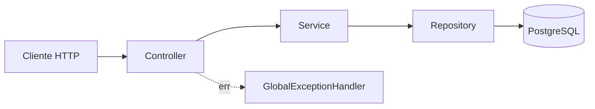

# Ticket Reservation System — Resolvendo Overselling sob Concorrência com PostgreSQL

> Um sistema de reserva de ingressos construído para responder a uma pergunta técnica específica, do tipo que aparece em entrevistas de engenharia sênior: **como garantir que 100 pessoas tentando comprar o último ingresso ao mesmo tempo nunca resultem em mais de uma venda?**

---

## O problema, em uma frase

Sistemas de reserva ingênuos sofrem de uma race condition clássica: ler o estoque, decidir "posso vender?" e escrever a reserva são três passos que, sob concorrência, podem se intercalar entre múltiplas requisições — permitindo que duas (ou cem) pessoas "vejam" a mesma última unidade disponível e todas a comprem. Isso já causou incidentes reais em vendas de shows, passagens aéreas e produtos com estoque limitado.

Este projeto implementa, testa e documenta uma solução para esse problema específico — não como exercício acadêmico, mas com prova empírica: teste de integração validando o comportamento real do PostgreSQL sob a estratégia escolhida.

## O que o sistema faz

- Organizadores criam eventos e definem tipos de ingresso com quantidade limitada.
- Compradores consultam disponibilidade em tempo real.
- **(Em construção)** Compradores reservam ingressos com garantia matemática de que o estoque nunca fica negativo, mesmo sob concorrência real e simultânea.

## Por que isso demonstra competência técnica real

Qualquer pessoa consegue construir um CRUD. O diferencial deste projeto está em três decisões que exigem entendimento de fundamentos, não só de sintaxe de framework:

1. **Diagnóstico correto do problema de concorrência** — não apenas "usar transação", mas entender *por que* uma transação comum com isolamento padrão (`READ_COMMITTED`) não é suficiente, e onde exatamente, no nível de locks do banco, a solução escolhida (`SELECT ... FOR UPDATE`) resolve isso.
2. **Comparação empírica, não teórica** — o projeto está estruturado como três repositórios (ver [ADR-000](./docs/adr/ADR-000-estrutura-repositorios.md)) para permitir comparar, com dados reais de teste de carga, locking pessimista contra locking otimista — em vez de simplesmente afirmar qual é "melhor".
3. **Defesa em profundidade** — regras de negócio críticas são reforçadas em mais de uma camada (validação na aplicação **e** `CHECK` constraint no banco), e essa segunda camada é validada por teste de integração real, não assumida.

---

## Arquitetura



Arquitetura em camadas deliberadamente simples — sem padrões mais elaborados (hexagonal, CQRS) que não se justificariam no porte deste projeto. Cada camada tem responsabilidade única:

- **Controller**: tradução HTTP pura, sem lógica de negócio.
- **Service**: regras de negócio e controle transacional, agnóstico a transporte (poderia ser chamado de qualquer ponto de entrada, não só HTTP).
- **Repository**: acesso a dados via Spring Data JPA.
- **GlobalExceptionHandler**: tradução centralizada de exceções em respostas HTTP consistentes.

Detalhamento completo em [docs/06-arquitetura.md](./docs/06-arquitetura.md).

## Stack e por que cada peça foi escolhida

| Tecnologia | Por quê (não "porque é popular") |
|---|---|
| **Java 21 + Spring Boot 4.1.1** | Stack corrente de mercado; Spring Data JPA permite tanto abstração de alto nível quanto queda controlada para SQL nativo (`SELECT FOR UPDATE`) quando necessário |
| **PostgreSQL** | O comportamento de locking e isolamento de transação do Postgres especificamente é o objeto de estudo do projeto — não é um banco genérico intercambiável |
| **Flyway** | SQL explícito e versionado, alinhado ao foco do projeto em comportamento de banco (ver [ADR-001](./docs/adr/ADR-001-flyway.md)) — Liquibase foi avaliado e descartado por adicionar abstração sobre o SQL justamente onde o SQL é protagonista |
| **Testcontainers** | Testes de integração contra PostgreSQL **real**, não H2 — porque H2 não reproduz fielmente o comportamento de locking do Postgres, que é exatamente o que precisa ser validado |
| **Docker Compose** | Ambiente reproduzível com um único comando, sem "funciona na minha máquina" |

## A decisão técnica central

O nível de isolamento padrão do Postgres (`READ_COMMITTED`) impede leitura de dados não commitados, mas **não impede** que duas transações leiam o mesmo valor "limpo, porém prestes a mudar" antes de qualquer uma escrever — a anomalia clássica chamada **lost update**:

1. Transação A lê `availableQuantity = 1`.
2. Transação B lê `availableQuantity = 1` (A ainda não commitou).
3. Ambas decidem, em memória, que a venda é válida.
4. Ambas escrevem e commitam com sucesso → **2 vendas para 1 vaga real**.

A solução adotada, `SELECT ... FOR UPDATE`, adquire um lock de linha **no momento da leitura**, não apenas na escrita — forçando a segunda transação a esperar na fila até a primeira liberar o lock (via commit ou rollback), e então ler o valor **já atualizado**. Isso serializa corretamente o acesso ao recurso disputado, sem impedir leituras comuns e concorrentes de acontecerem livremente (graças ao MVCC do Postgres).

Raciocínio completo, incluindo o trade-off de throughput sob altíssima contenção — que será medido empiricamente contra locking otimista — em [ADR-002](./docs/adr/ADR-002-estrategia-lock-pessimista.md).

---

## Desafios reais enfrentados (e como foram resolvidos)

Nenhum destes é hipotético — todos aconteceram durante o desenvolvimento e foram investigados até a causa raiz, não contornados com gambiarra:

- **Reestruturação de pacotes do Spring Boot 4**: `@DataJpaTest` e `@AutoConfigureTestDatabase` mudaram de pacote entre Spring Boot 3.x e 4.x (documentação e tutoriais online frequentemente desatualizados para essa mudança). Resolvido consultando diretamente o javadoc oficial da versão exata em uso, em vez de assumir.
- **Renomeação de artifacts no Testcontainers 2.x**: `org.testcontainers:junit-jupiter` deixou de existir, substituído por `testcontainers-junit-jupiter`. Identificado via investigação do erro real do Maven, não tentativa e erro.
- **Regressão acidental de versão**: durante troubleshooting intenso, o `pom.xml` foi revertido de Spring Boot 4.1.1 para 3.3.4 sem intenção — rastreado comparando `dependency:tree` com os logs de execução até encontrar a causa raiz.
- **N+1 queries e lazy loading**: decisão consciente de `FetchType.LAZY` em `TicketType.event`, com `spring.jpa.open-in-view=false` desligado deliberadamente para que problemas de carregamento apareçam explicitamente (`LazyInitializationException`) no lugar certo, em vez de mascarados durante a serialização HTTP.

Registro técnico completo, incluindo os mecanismos exatos de cada problema, em [docs/aprendizado.md](./docs/aprendizado.md).

---

## Como executar

```bash
# 1. Variáveis de ambiente
cp .env.example .env

# 2. Banco de dados
docker compose up -d

# 3. Aplicação
./mvnw spring-boot:run
```

API disponível em `http://localhost:8080`. Endpoints documentados em [docs/09-api.md](./docs/09-api.md).

## Como rodar os testes

```bash
./mvnw test
```

Requer Docker ativo — os testes de integração sobem um PostgreSQL real e descartável via Testcontainers (não um banco em memória, para garantir fidelidade ao comportamento real do Postgres).

**Cobertura atual**: testes unitários (Mockito) validando regras de negócio isoladas + teste de integração validando que o banco rejeita, na prática, uma violação de constraint que a aplicação deveria ter impedido — prova de que a defesa em profundidade funciona de verdade, não só na teoria. Detalhes em [docs/11-testes.md](./docs/11-testes.md).

---

## Estado atual e próximos passos

**Concluído**: modelagem de domínio (evento, tipo de ingresso), API REST com tratamento de erro consistente, cobertura de testes em duas camadas.

**Em andamento**: entidade de reserva e endpoint com locking pessimista — o núcleo do projeto.

**Planejado**: teste de carga (k6) provando "zero overselling" sob concorrência real com números documentados; comparação de throughput contra locking otimista; cache de leitura com Redis (fora do caminho crítico de concorrência, por decisão consciente).

Roadmap completo em [docs/15-roadmap.md](./docs/15-roadmap.md).

---

## Documentação técnica completa

Este projeto foi desenvolvido com documentação de nível profissional desde o início — não escrita retroativamente. Índice completo em [README.md](./README.md#documentação).
