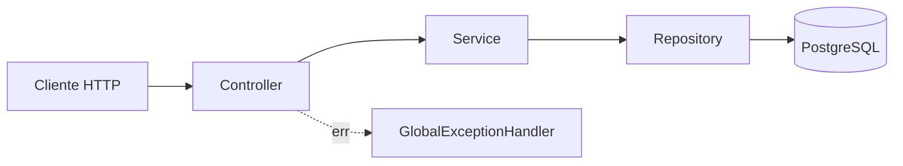

# 06 — Arquitetura

## Visão geral

Arquitetura em camadas simples (não há justificativa, neste porte de projeto, para padrões mais elaborados como hexagonal/clean architecture — decisão consciente de evitar overengineering).

## Responsabilidade de cada camada

| Camada | Responsabilidade | Não deve conter |
|---|---|---|
| **Controller** | Tradução HTTP: extrair `@PathVariable`/`@RequestBody`, decidir status code, montar header `Location` | Lógica de negócio, acesso a Repository |
| **Service** | Regras de negócio, orquestração de Repository(s), controle transacional (`@Transactional`) | Conhecimento de HTTP/protocolo de transporte |
| **Repository** | Acesso a dados via Spring Data JPA | Regra de negócio |
| **DTO** | Contrato de entrada/saída da API, desacoplado da entidade JPA | Lógica, referência a Repository |
| **Entity (JPA)** | Mapeamento objeto-relacional | Validação de entrada (isso é papel do DTO) |
| **GlobalExceptionHandler** | Tradução centralizada de exceções em respostas HTTP padronizadas | Lógica de negócio |

## Por que Service é agnóstico a transporte

Os métodos de Service (ex.: `TicketTypeService.createTicketType`) recebem tipos primitivos e DTOs puros — nunca `HttpServletRequest`, nunca anotações `@RequestBody`. Isso significa que a mesma lógica de negócio poderia ser reutilizada por qualquer outro ponto de entrada (fila de mensageria, CLI administrativo, outro protocolo) sem duplicação. Ver discussão completa em `docs/aprendizado.md`.

## Decisão de reuso entre Services

`TicketTypeService` depende de `EventService` (não de `EventRepository` diretamente) para validar existência de evento. Isso centraliza a lógica de "o que significa um evento não existir" em um único lugar, evitando duplicação de `EventNotFoundException` espalhada. Trade-off: acoplamento direto entre Services — aceitável no porte atual do projeto; seria reavaliado em uma arquitetura com bounded contexts mais estritos.

## Tratamento de erros

Centralizado via `@RestControllerAdvice` (`GlobalExceptionHandler`), mapeando:

| Exceção | Status HTTP | Origem |
|---|---|---|
| `EventNotFoundException` (customizada) | 404 | Lançada explicitamente pelo domínio quando um evento não é encontrado |
| `MethodArgumentNotValidException` (Spring) | 400 | Falha de Bean Validation (`@Valid`) nos DTOs |

Todas as respostas de erro seguem o mesmo formato (`ErrorResponse`: `status`, `message`, `timestamp`), garantindo consistência para quem consome a API.

**Decisão consciente de não capturar `IllegalArgumentException` genericamente**: um handler para essa exceção padrão da linguagem foi cogitado e descartado — capturar um tipo tão genérico poderia mascarar bugs de programação reais (não relacionados a regra de negócio) como se fossem respostas HTTP intencionais.

## Persistência e transações

- Toda escrita passa por método `@Transactional` no Service.
- Consultas usam `@Transactional(readOnly = true)`, permitindo otimizações do Hibernate.
- `spring.jpa.open-in-view=false` — desligado deliberadamente para evitar que lazy-loading não intencional (N+1) seja mascarado durante a serialização da resposta HTTP. Ver `docs/aprendizado.md` para a explicação completa do mecanismo.

## Fetch strategy

`TicketType.event` é mapeado como `@ManyToOne(fetch = FetchType.LAZY)` — decisão consciente, não o padrão do JPA (que é `EAGER` para `@ManyToOne`). Justificativa: nenhum fluxo atual do sistema precisa navegar de `TicketType` até os dados completos de `Event` (o `eventId` já está disponível diretamente na FK, sem exigir join). Ver ADR e `docs/aprendizado.md`.

## Preparação para o Épico 2

A arquitetura atual já está desenhada considerando a chegada da tabela `reservation` e do controle de concorrência:
- `@Transactional` já é hábito estabelecido — vai ser o que garante a atomicidade da leitura com lock + escrita.
- O relacionamento `Event → TicketType` usa `CascadeType.ALL` + `ON DELETE CASCADE` no banco — **isso precisará ser revisitado** quando `reservation` existir, para não apagar reservas de compradores reais ao excluir um evento.
