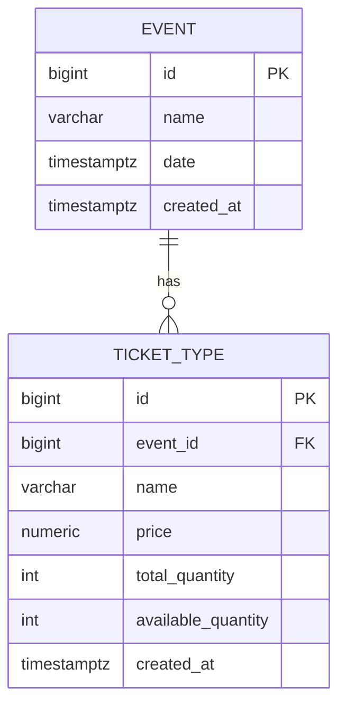

# 08 — Modelagem de Dados

## Diagrama (Épico 1)

## Tabela `event`

| Coluna | Tipo | Constraints |
|---|---|---|
| `id` | `BIGINT` | `GENERATED ALWAYS AS IDENTITY PRIMARY KEY` |
| `name` | `VARCHAR(255)` | `NOT NULL` |
| `date` | `TIMESTAMP WITH TIME ZONE` | `NOT NULL` |
| `created_at` | `TIMESTAMP WITH TIME ZONE` | `NOT NULL`, `DEFAULT CURRENT_TIMESTAMP` |

## Tabela `ticket_type`

| Coluna | Tipo | Constraints |
|---|---|---|
| `id` | `BIGINT` | `GENERATED ALWAYS AS IDENTITY PRIMARY KEY` |
| `event_id` | `BIGINT` | `NOT NULL`, FK → `event(id)`, `ON DELETE CASCADE` |
| `name` | `VARCHAR(100)` | `NOT NULL` |
| `price` | `NUMERIC(10,2)` | `NOT NULL` |
| `total_quantity` | `INT` | `NOT NULL`, `CHECK (total_quantity > 0)` |
| `available_quantity` | `INT` | `NOT NULL`, `CHECK (available_quantity >= 0)`, `CHECK (available_quantity <= total_quantity)` |
| `created_at` | `TIMESTAMP WITH TIME ZONE` | `NOT NULL`, `DEFAULT CURRENT_TIMESTAMP` |

Índice adicional: `idx_ticket_type_event_id` em `event_id` (Postgres não cria índice automático para FK; necessário para consultas eficientes do RF-002 conforme o volume de dados cresce).

## Decisões de modelagem

- **Nomenclatura em inglês**: schema e código em inglês (padrão de mercado), documentação em português. Ver `docs/aprendizado.md`.
- **`ON DELETE CASCADE`**: apaga `ticket_type` em cascata ao excluir um `event`. Aceitável no Épico 1 (sem dados de reserva ainda) — **precisa ser revisitado no Épico 2**, quando reservas de compradores reais existirão e não deverão ser apagadas silenciosamente.
- **Dupla constraint de `available_quantity`**: `>= 0` e `<= total_quantity` — reforço defensivo em nível de banco para RN-005, independente da camada de aplicação.
- **Mapeamento JPA — fetch LAZY em `TicketType.event`**: decisão consciente (diferente do padrão `EAGER` de `@ManyToOne`). Ver `docs/06-arquitetura.md` e `docs/aprendizado.md` para a justificativa completa (nenhum fluxo atual precisa navegar até os dados do `Event` a partir de um `TicketType` — o `eventId` já está disponível diretamente).

## Migrations aplicadas

| Versão | Arquivo | Descrição |
|---|---|---|
| V1 | `V1__create_event_and_ticket_type_tables.sql` | Criação das tabelas `event` e `ticket_type` |
